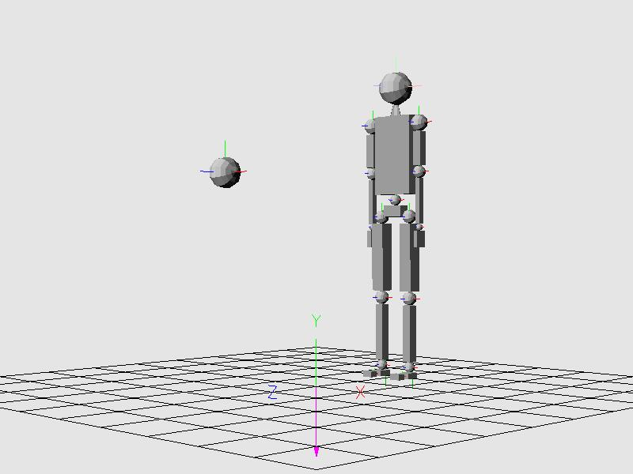
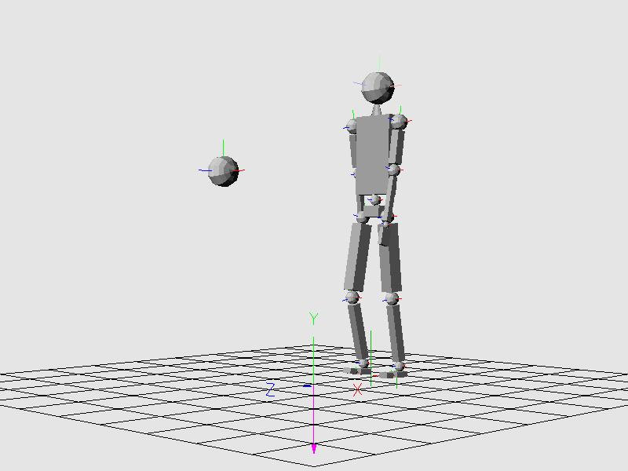
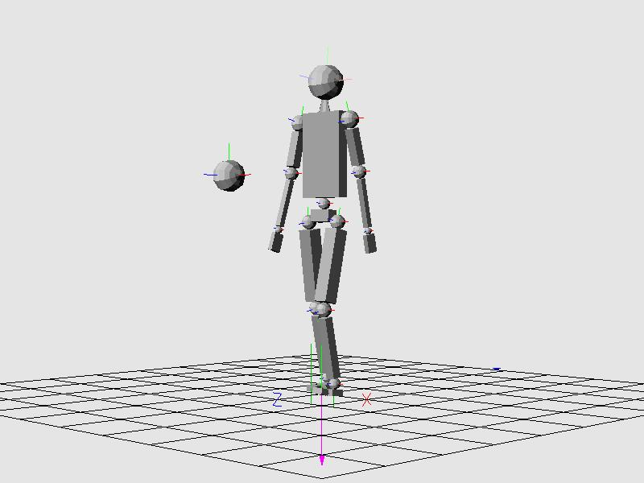

## README ##

 

|                                                                                                                                                                                   | Animation Walking Damped                                                                                                                                                           |                                                                                                                                                                                    |
|-----------------------------------------------------------------------------------------------------------------------------------------------------------------------------------|------------------------------------------------------------------------------------------------------------------------------------------------------------------------------------|------------------------------------------------------------------------------------------------------------------------------------------------------------------------------------|
|  |  |  |
| Frame 0                                                                                                                                                                           | Frame 40                                                                                                                                                                           | Frame 80                                                                                                                                                                           |

 

### viewODE ###

A Python program to view and control a simulated humanoid robotic figure using PyODE for modeling articulated rigid body dynamics, PyOpenGL for 3D rendering and Pillow (PIL) for image capture and conversion. The program was developed as a simplistic virtual dynamics environment to explore the capabilities of the Open Dynamics Engine (ODE) library in modeling a rudimentary humanoid robot and is not intended to be a robust robot simulation, development and experimentation tool such as [V-REP](http://www.coppeliarobotics.com/index.html), [GAZEBO](http://gazebosim.org/), [RoboPy](https://github.com/adityadua24/robopy) or [Pybotics](https://github.com/nnadeau/pybotics). Inspiration for its development began from Matt Heinzen's [PyODE Ragdoll Physics Tutorial](http://monsterden.net/software/ragdoll-pyode-tutorial) and initial effort was coincident with, but independent of, related research being conducted by the character animation group at University of British Columbia (UBC) on their [Simbicon](https://www.cs.ubc.ca/~van/papers/Simbicon.htm) and [Cartwheel 3D](https://code.google.com/archive/p/cartwheel-3d/) projects.

### Repository Directory Structure ###

The main program file is **viewODE.py**. Other Python files are object class modules (Actions, Capture, Control, Figure, Frame, Render, Select and Solids), static procedure modules (Joints, Motors and vecMath), and various utility programs and scripts.

* The root directory contains the main program file and imported object class and static procedure module files.
* The ./docs subdirectory contains a keyboard and mouse input options guide, design notes and howto tutorials.
* The ./test subdirectory contains unit test driver programs and scripts.
* The ./util subdirectory contains Python and shell scripts for converting captured JPEG image files to animated GIFs and MP4 videos, and to generate **XGraph** and **gnuplot** data files from debug print text files.

### Execution Prerequisites ###

The **viewODE** program was originally developed with Python 2.5.2, ODE 0.7 and PyODE 1.2.0 on a Windows XP platform, later development efforts had been with Python 2.7.6 and 3.4.3 on an Ubuntu 14.04 platform and recent development with Python 2.7.17 and 3.6.9 on an Ubuntu 18.04 platform.

* Python 2.7.6 or 3.4.3
* ODE 0.11.1 and PyODE 1.2.1 for Python 2.7.6
* ODE 0.12 with Python binding for Python 2.7.6 or 3.4.3
* PyOpenGL 3.0.2
* Pillow 2.3.0
* ODE 0.16.2 with Python binding for Python 2.7.17 or 3.6.9
* PyOpenGL 3.1.0
* Pillow 6.2.1
* Mouse with 3 buttons (left for picking, middle for view rotation, right for start/pause)

### Execution Overview ###

The **viewODE** program presents an interactive display for three-dimensional (3D) rendering of a dynamically active humanoid robotic figure comprised of rigid body solids connected with motor actuated joints. The view point and robotic figure can be manipulated using the keyboard and mouse.

* Entering 'python viewODE.py \[stop_time] \[options:Z:delay time:actions]' on a command shell line when in the root directory will open a **viewODE** window in which will be displayed a ground plane grid with the world reference coordinate system frame +X, +Y and +Z axes positioned at the world space origin as shown [here](./docs/start_image.png). If the optional stop_time (in seconds) is given as a command line argument, the program will terminate when the specified stop time is exceeded. If the optional "options:Z:delay_time:actions" colon delimited sequence is specified, the options are set prior to unpausing simulation with 'Z', then specified actions are set after the delay time has elapsed. For example, the sequence "H:D:Z:0.5:Y:W" would set action debug print and rotational damping, unpause the simulation; waiting till simulation time is at 0.5 seconds before setting stride mode and starting walking action. Program status messages and debug output are printed to the command shell unless otherwise redirected.
* Pressing the 'Z' key or clicking the right mouse button will initiate the simulation by displaying a humanoid figure standing on the ground plane and a solid sphere (target) positioned in front of the figure as shown [here](./docs/begin_image.png). Mouse motion while the middle button is pressed will rotate the view about the view space X and Y axes. Apparent rotation of the ground plane will not affect dynamics if gravitational force remains fixed along the world -Y axis.
* The figure is initially in a standing state and will actively attempt to remain standing by adjusting torques on the ankle, knee, hip, waist and neck joint motors. While the simulation is running, key presses described in [./docs/InputOptions.txt](./docs/InputOptions.txt) can change the following.
    * arm and leg bone shape (box or rod)
    * joint type (universal or ball)
    * action mode (standing, suspended, resting, striding, reaching, kicking or walking)
    * joint damping mode (none, rotational or feedback torque)
    * manipulated joint forcing torque modes (non-forced axis limiting and maintain joint rotation)
    * active motor axis (none or +/- x, y or z)
    * gravity vector fixed along world -Y axis or rotatable about world X axis to be along view space -Y axis
    * rendering mode (orthographic or perspective, selection volume rendering)
    * simulation modes (paused, reset, image capture)
    * debug output (render, actions and control)
* Pressing the left mouse button while the mouse cursor is on a solid will select the solid for manipulation. The selected solid is rendered as a wire frame. If the target sphere is selected, it can be moved to apply an impact force on the figure or to influence the figure's reaction while in reaching or kicking mode. If the selected solid is attached to the figure's frame, then a force or torque is applied to the solid depending upon the corresponding body part.
    * A grabbing force is applied to solids corresponding to these body parts: toes, foot, shin, thigh, pelvis, torso, hand, forearm, upper arm and head.
    * A motor torque is applied to joint corresponding to these body parts: ball of foot, ankle, knee, hip, waist, wrist, elbow, shoulder (as shown [here](https://youtu.be/LgRRmufM78g)) and neck.
* To collect debug print data, redirect shell output to a text file when invoking **viewODE** such as: 'python viewODE.py 1>output.txt 2>&1'. Specific joint data records can be extracted from the output file and written to another text file using a utility such as **grep**, and the extracted joint data records file can then be processed with [./util/txt2dat.py](./util/txt2dat.py) to produce a data file suitable for input to plotting programs such as **XGraph** or **gnuplot** as demonstrated with the provided **Bash** shell script [./util/extract_stride_action_data.sh](./util/extract_stride_action_data.sh).
* The simulation can be paused/resumed by pressing the 'Z' key or by pressing/holding/releasing the right mouse button.
* To terminate the program, press the 'esc' key or close the **viewODE** window.

### Caveats ###

1. The initial figure frame configuration utilizing universal joints apparently experiences transient contact forces and joint dynamics which result in the robotic figure being unable to stand in a fixed position. Either activate joint rotational damping with 'D' keypress or select frame ball joints with 'B' keypress, then reset figure's stance with 'A' keypress. Additionally, a double precision ODE library and Python ODE package may be necessary for dynamics engine stability. Both may be built from source maintained at [ODE DEVs ODE repository](https://bitbucket.org/odedevs/ode/src/master/).
2. When executing **viewODE.py** with Python 3, pressing the 'ESC' key to terminate processing may result in a segmentation fault. If so, terminate processing by closing the **viewODE** window instead of pressing the 'ESC' key.
3. Since **viewODE** evolved over the years from Matt Heinzen's ragdoll-pyode-tutorial it has become a mixture of procedural and object-oriented programming structures; consequently embodying ill-advised coding constructs such as global variables and global import statements.
4. Experimentation with various action and control algorithms to work within capabilities and limitations of ODE has resulted in some non-functional and erroneous code; just ignore it.

### Attributions ###

* Matthias Baas and Pierre Gay for the **tutorial3.py** example program in the [Python-ODE Bindings](https://sourceforge.net/projects/pyode/) project which was used as a basis for the simulation loop, solid rendering, and collision, keypress, mouse and idle callbacks.
* Matt Heinzen for his [PyODE Ragdoll Physics Tutorial](http://monsterden.net/software/ragdoll-pyode-tutorial) which was used as source for vector math functions and jointed rigid body modeling of a humanoid figure.

### Support ###

* For install or usage issues concerning ODE and PyODE, consult the appropriate document, wiki, forum or mailing list provided at the SourceForge projects for [Open Dynamics Engine](https://sourceforge.net/projects/opende/) and [Python-ODE Bindings](https://sourceforge.net/projects/pyode/) or at the original [ODE](http://ode.org/) and [PyODE](http://pyode.sourceforge.net/) websites. Providers of distribution packages for ODE and PyODE may also be helpful in resolving installation issues.
* For guidance on exploring the features and capabilities of **viewODE**, consult the howto tutorials provided in the **./docs** subdirectory.

### Disclaimers ###

* See the file [DISCLAIMER-GaryDeschaines](./DISCLAIMER-GaryDeschaines)
* See the file [DISCLAIMER-PyODE](./DISCLAIMER-PyODE)
* See the file [DISCLAIMER-MattHeinzen](./DISCLAIMER-MattHeinzen)
